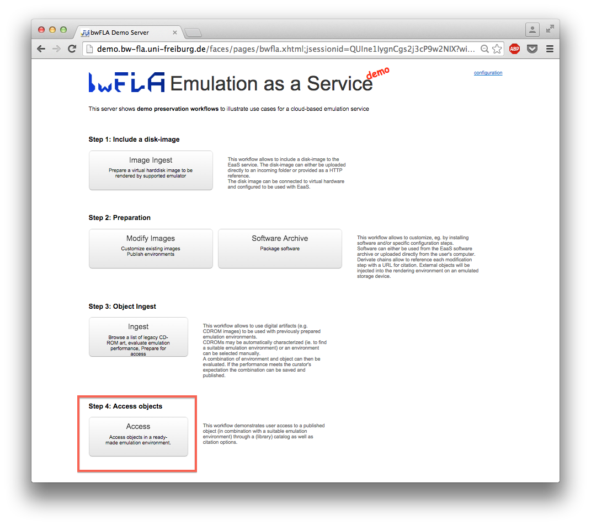
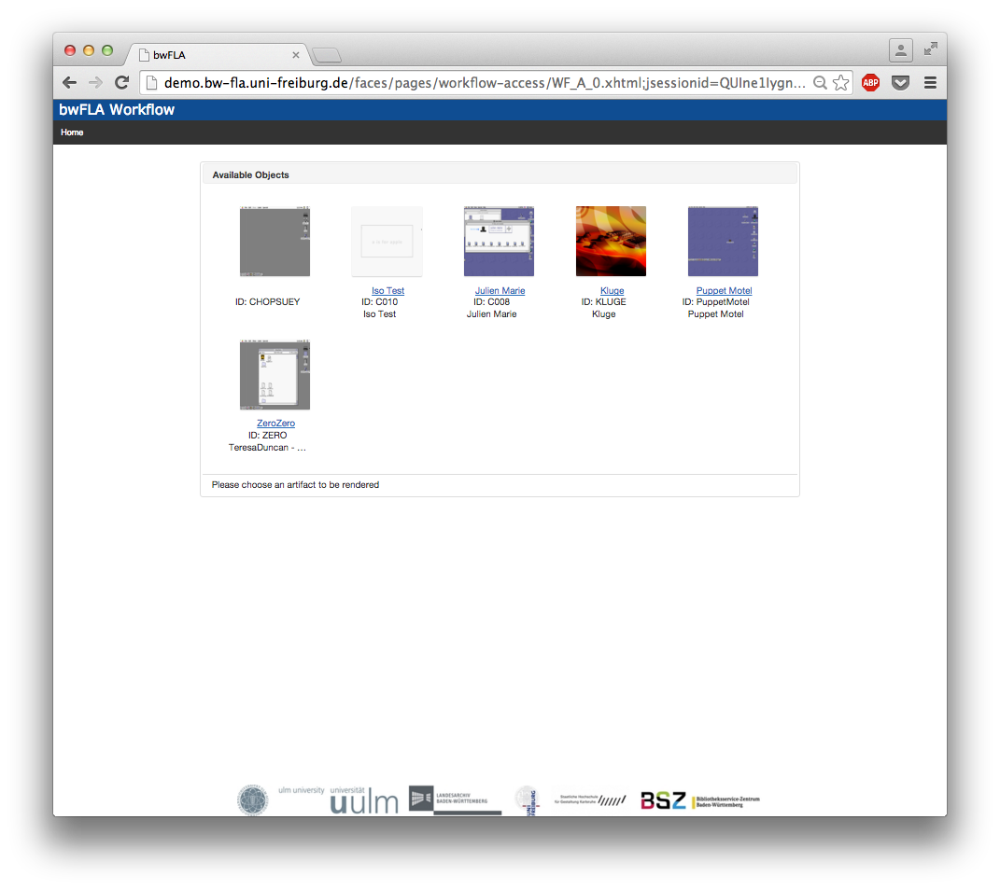
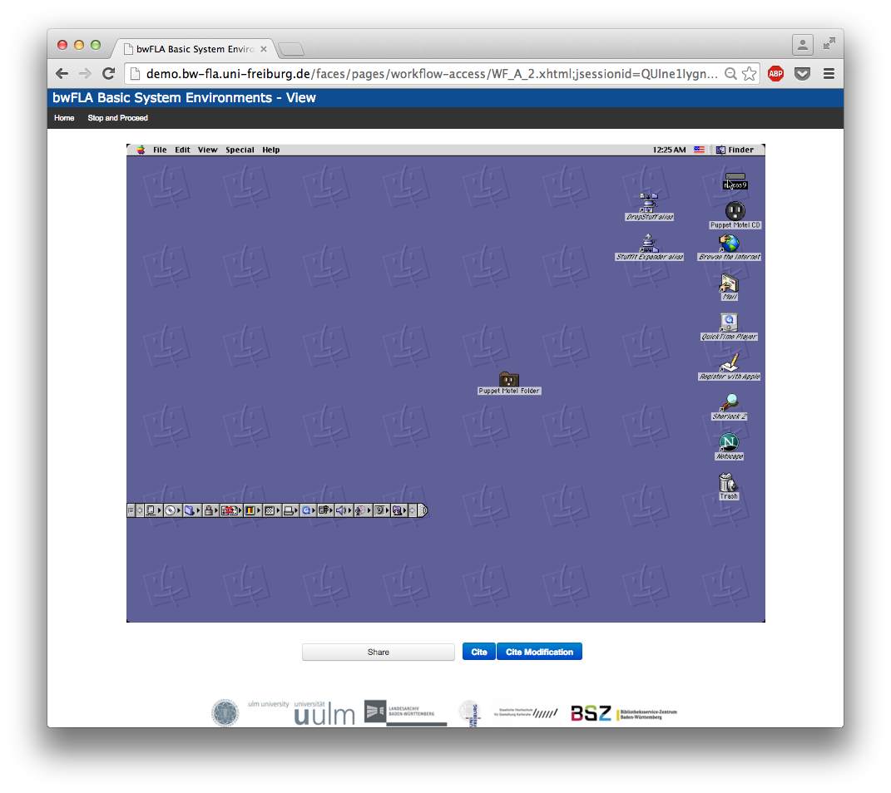
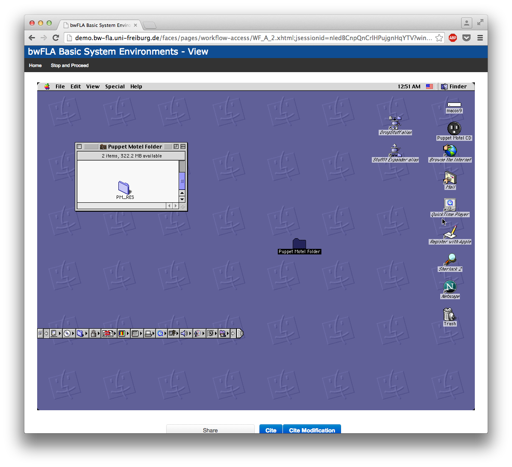
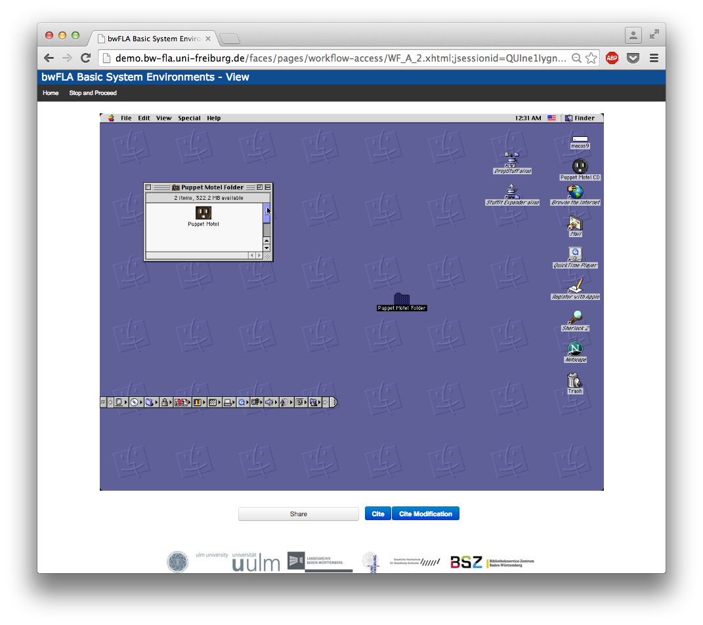
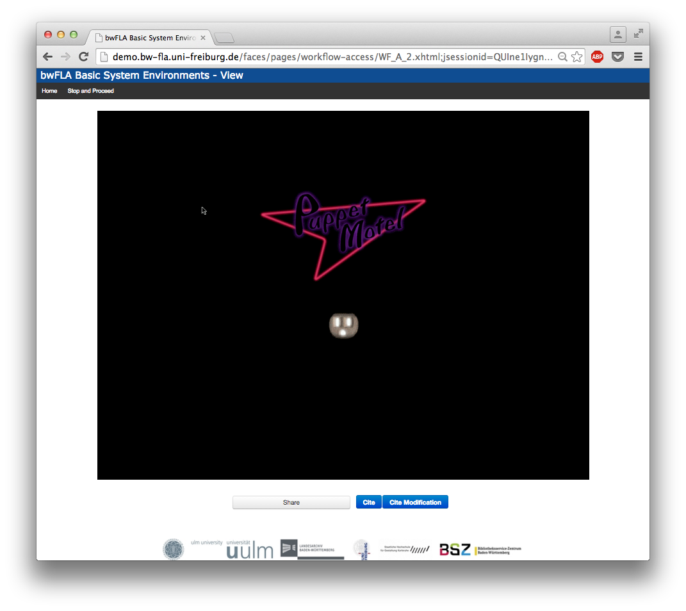

##The bwFLA demo server provides access to cloud-based emulation: http://demo.bw-fla.uni-freiburg.de/

The emulation as a service framework provides a number of options for accessing media in different emulation environments.

In this workshop, we will use two methods:

  1. access and perform artworks via iso files already stored on the bwFLA demo server.
  2. upload a new iso file to the bwFLA demo server to access and perform an artwork in an emulated environment.  

### 1. To access and perform artworks via iso files already on the bwFLA demo server:

Use "Step 4: Access objects" to choose an iso from a selection of media images available on the bwFLA server.  Click on "Access." 

You will see a window that looks like this, presenting a selection of objects already loaded to the bwFLA server and saved within an appropriate emulation environment.  
Click on the object you would like to access.

You'll see a progress bar as the emulator starts to load.  

Then you'll see the emulator start up inside the browser window.

You can see the Puppet Motel CD loaded in the upper right-hand corner of the screen.  

In this saved environment, the Puppet Motel CD has already been opened for you, and the Puppet Motel folder has been copied to the Desktop.  That is the folder you will need to open to access the artwork.  
Double-click on the Puppet Motel Folder to open it.

It will look like this.  

Scroll up inside this window to access the Puppet Motel program.
Which you will see here.  You can recognize it by the electrical-outlet icon.  
Double-click on the Puppet Motel icon to start the artwork playing.  

Puppet Motel will open to the title screen, which looks like this.  
Notice that there is a "Sign In" option.  You can enter whatever name you would like to use for this game, or click the glowing purple dot to be "Anonymous."

### 2. To upload a new iso file to the bwFLA demo server to access and perform an artwork in an emulated environment:

Use "Step 2: Preparation".  Click on "Modify images".

This option allows you to access a number of emulators, choose pre-configured OS, and load a disk image from your computer to the demo server, to run in the emulated environment.

First select an emulator from menu on left.

This choice brings us the OS menu on the right

You can also choose to load a derivate image that you or another user has saved.  These derivates are OSes that have media images or software included, to save time having to make repeated modifications.

Press next, and the emulator loads, presenting you with the computer desktop.  
